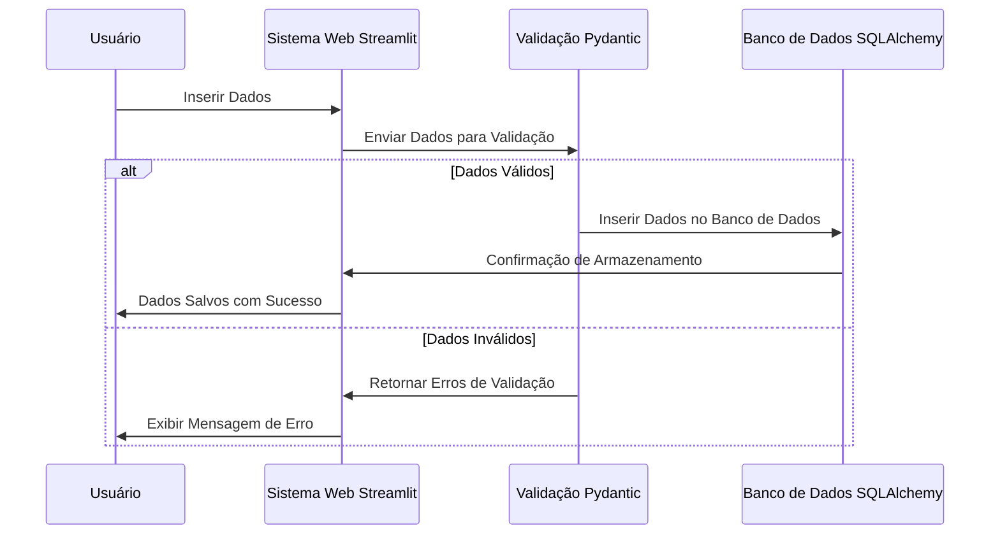

### **README - Sistema de CRM e Vendas da ZapFlow**

Esse é o repositório da primeira parte da aula

[](https://www.youtube.com/watch?v=I-4noY9hGTQ)

---

### **Introdução**

O Sistema de CRM e Vendas da ZapFlow é uma aplicação desenvolvida para gerenciar e validar vendas de forma simples e eficiente. O sistema é composto por um frontend interativo desenvolvido com Streamlit, validação de dados com Pydantic, e integração com um banco de dados PostgreSQL usando Psycopg2.

### **Sequence Diagram**

O diagrama a seguir ilustra o fluxo de interação entre o usuário, o sistema web, a validação dos dados e o banco de dados.


---

### **Tecnologias Utilizadas**

#### **Streamlit**

- **Descrição:** Streamlit é uma biblioteca Python de código aberto que permite a criação de aplicativos web interativos de forma rápida e fácil. Utilizado principalmente para construir dashboards e interfaces de dados, o Streamlit é ideal para prototipagem rápida e visualização de dados sem a necessidade de conhecimentos avançados em desenvolvimento web.
- **Uso no Projeto:** Utilizado para construir o frontend da aplicação, permitindo que os usuários insiram dados de vendas de forma interativa e visualizem os resultados diretamente na interface.

#### **Pydantic**

- **Descrição:** Pydantic é uma biblioteca de validação de dados que utiliza modelos baseados em classes Python para garantir que os dados inseridos estejam no formato correto. É amplamente utilizada para validação e serialização de dados, garantindo integridade e consistência.
- **Uso no Projeto:** Pydantic é utilizado para validar os dados inseridos pelos usuários no frontend, garantindo que as informações estejam corretas antes de serem processadas e salvas no banco de dados.

#### **Psycopg2**

- **Descrição:** Psycopg2 é uma biblioteca que permite a interação com bancos de dados PostgreSQL diretamente através de Python, facilitando a execução de comandos SQL e o gerenciamento das conexões.
- **Uso no Projeto:** Utilizado para conectar a aplicação ao banco de dados PostgreSQL, executar comandos SQL, e salvar os dados validados.

#### **SQLAlchemy (Opcional)**

- **Descrição:** SQLAlchemy é uma poderosa biblioteca de SQL toolkit e ORM (Object-Relational Mapping) para Python. Ele permite a interação com bancos de dados relacionais de forma mais intuitiva, utilizando objetos Python em vez de comandos SQL diretamente.
- **Uso no Projeto:** SQLAlchemy poderia ser utilizado para gerenciar a conexão com o banco de dados PostgreSQL e facilitar as operações de CRUD (opcional, não implementado no exemplo atual).

#### **MkDocs**

- **Descrição:** MkDocs é uma ferramenta estática de documentação em Python que permite a criação de sites de documentação de forma simples e estruturada. É especialmente útil para projetos que precisam de uma documentação clara e acessível para os desenvolvedores e usuários.
- **Uso no Projeto:** MkDocs é utilizado para gerar a documentação do sistema, detalhando como o projeto foi estruturado, as funcionalidades desenvolvidas, e como o sistema deve ser mantido e atualizado.

### **Estrutura do Projeto**

#### **Divisão dos Módulos**

O projeto está dividido em módulos para organizar melhor o desenvolvimento e facilitar a manutenção futura. A seguir, estão os principais módulos do projeto:

1. **Frontend (`app.py`):**
   - Responsável pela interface do usuário onde os dados de vendas são inseridos e exibidos.
   - Desenvolvido com Streamlit para proporcionar uma interação simples e amigável.

2. **Contrato (`contrato.py`):**
   - Define as regras de validação dos dados utilizando Pydantic.
   - Assegura que os dados inseridos no frontend estão no formato correto e cumprem as regras estabelecidas pelo sistema.

3. **Banco de Dados (`database.py`):**
   - Gerencia a conexão e as operações com o banco de dados PostgreSQL utilizando Psycopg2.
   - Facilita a interação com o banco sem a necessidade de escrever SQL diretamente.

### **Passos para Configuração e Execução**

#### **1. Criar o Repositório**

- **Passo:** Inicie um novo repositório no GitHub ou GitLab para versionar o projeto.
- **Comando:**
  ```bash
  git init
  ```

#### **2. Escolher a Versão do Python para 3.12.1**

- Utilize `pyenv` para gerenciar e definir a versão correta do Python:
  ```bash
  pyenv install 3.12.1
  pyenv local 3.12.1
  ```

#### **3. Criar um Ambiente Virtual**

- **Passo:** Crie um ambiente virtual para isolar as dependências do projeto.
- **Comando:**
  ```bash
  python3.12 -m venv .venv
  ```

#### **4. Entrar no Ambiente Virtual**

- **Comando:**
  - **Windows:**
    ```bash
    .venv\Scripts\activate
    ```
  - **Linux/Mac:**
    ```bash
    source .venv/bin/activate
    ```

#### **5. Instalar as Dependências**

- **Instalar os pacotes necessários:**
  ```bash
  pip install -r requirements.txt
  ```

#### **6. Executar o Frontend**

- **Comando para rodar o frontend com Streamlit:**
  ```bash
  streamlit run app.py
  ```

#### **7. Configurar o PostgreSQL**

- **Criar o banco de dados e a tabela necessária:**
  ```sql
  CREATE DATABASE crm_vendas;
  CREATE TABLE vendas (
      id SERIAL PRIMARY KEY,
      email VARCHAR(255) NOT NULL,
      data TIMESTAMP NOT NULL,
      valor NUMERIC NOT NULL,
      quantidade INTEGER NOT NULL,
      produto VARCHAR(50) NOT NULL
  );
  ```

#### **8. Criar a Conexão com o PostgreSQL**

- A conexão é gerenciada no módulo `database.py` utilizando `psycopg2`.

### **Conclusão**

Este README serve como guia para configurar, entender, e executar o Sistema de CRM e Vendas da ZapFlow. O projeto combina uma série de tecnologias modernas para proporcionar uma solução eficiente e fácil de usar para gestão de vendas. Com módulos bem definidos e documentação clara, o sistema está preparado para evoluir e se adaptar às necessidades dos usuários.